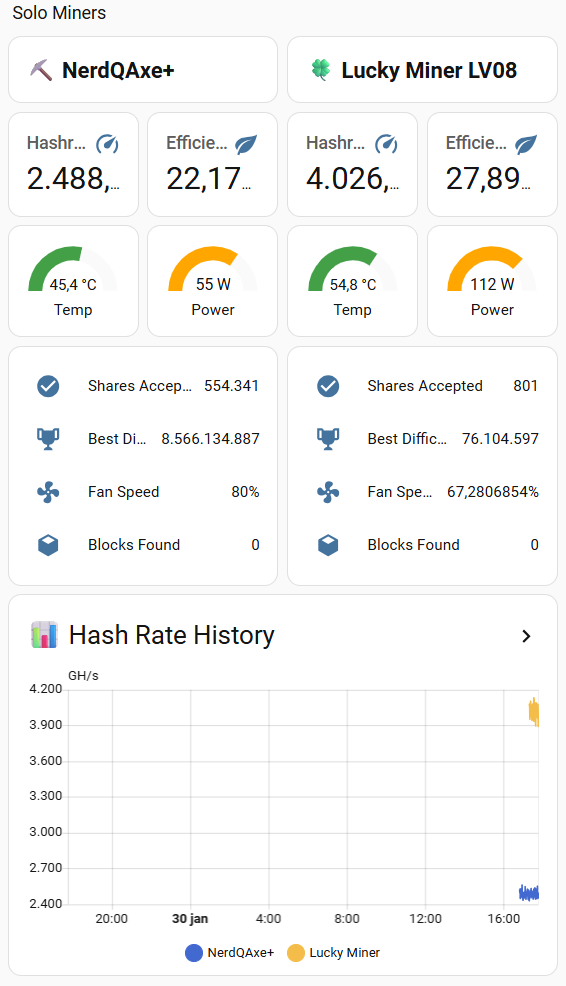
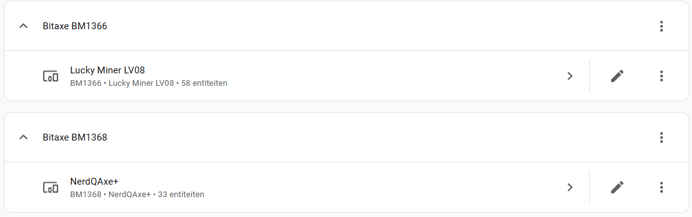
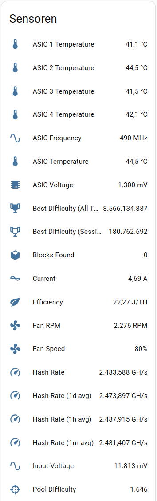
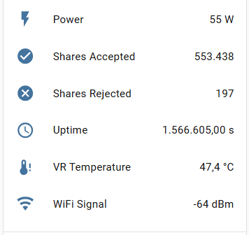

[![GitHub Release][releases-shield]][releases]
[![GitHub Activity][commits-shield]][commits]
[![License][license-shield]](LICENSE)
![Project Maintenance][maintenance-shield]

[](https://www.paypal.me/cyberjunkynl/)
[](https://github.com/sponsors/cyberjunky)

# Bitaxe Monitor Integration

A Home Assistant custom integration to monitor your [Bitaxe](https://bitaxe.org/) Bitcoin mining devices. Track hash rates, temperatures, power consumption, shares, and more – all from your Home Assistant dashboard!

## About Bitaxe

Bitaxe is an open-source ASIC Bitcoin miner designed for solo mining. This integration connects to your Bitaxe device's [AxeOS API](https://osmu.wiki/bitaxe/api/) to provide real-time monitoring and statistics.

## Features

- **Easy Setup**: GUI-based configuration through Home Assistant's UI
- **Real-time Monitoring**: Track all key mining metrics
- **Power Metrics**: Power consumption, input voltage, current, and ASIC voltage
- **Thermal Monitoring**: ASIC temperature, VR temperature, and individual ASIC temps (multi-ASIC units)
- **Performance Stats**: Hash rate (instant, 1m, 1h, 1d averages), frequency, and efficiency (J/TH)
- **Mining Progress**: Shares accepted/rejected, best difficulty, blocks found
- **Device Health**: Fan speed/RPM, WiFi signal strength, uptime
- **Auto-discovery**: Automatically detects ASIC model and firmware version

## Screenshots





 

## Sensors

The integration **automatically detects** which sensors are available on your specific Bitaxe model. Only sensors supported by your hardware will be created.

### Power & Electrical

| Sensor | Description | Unit |
|--------|-------------|------|
| Power | Current power consumption | W |
| Max Power Limit | Maximum power limit setting | W |
| Input Voltage | Power supply voltage | mV |
| Nominal Voltage | Expected input voltage | V |
| Current | Electrical current draw | A |
| Core Voltage Target | Target ASIC core voltage | mV |
| Core Voltage Actual | Actual ASIC core voltage | mV |

### Temperature

| Sensor | Description | Unit |
|--------|-------------|------|
| ASIC Temperature | Main chip temperature | °C |
| ASIC Temperature 2 | Secondary temp sensor (if available) | °C |
| VR Temperature | Voltage regulator temperature | °C |
| Target Temperature | Fan control target temperature | °C |
| ASIC N Temperature | Individual ASIC temps (multi-chip units) | °C |

### Performance

| Sensor | Description | Unit |
|--------|-------------|------|
| Hash Rate | Current hash rate | GH/s |
| Hash Rate (1m avg) | 1-minute average | GH/s |
| Hash Rate (10m avg) | 10-minute average | GH/s |
| Hash Rate (1h avg) | 1-hour average | GH/s |
| Hash Rate (1d avg) | 1-day average | GH/s |
| Expected Hash Rate | Target hash rate | GH/s |
| ASIC N Hash Rate | Per-ASIC hash rate (multi-chip units) | GH/s |
| ASIC Frequency | Mining chip frequency | MHz |
| ASIC Core Count | Number of mining cores | - |
| Error Rate | Percentage of errors | % |
| Efficiency | Power efficiency (computed) | J/TH |

### Mining Statistics

| Sensor | Description |
|--------|-------------|
| Best Difficulty (All Time) | Highest difficulty share ever found |
| Best Difficulty (Session) | Highest difficulty share this session |
| Pool Difficulty | Current pool difficulty |
| Network Difficulty | Bitcoin network difficulty |
| Block Height | Current blockchain height |
| Shares Accepted | Total accepted shares |
| Shares Rejected | Total rejected shares |
| Blocks Found | Number of blocks found |

### Fan & Cooling

| Sensor | Description | Unit |
|--------|-------------|------|
| Fan Speed | Current fan speed | % |
| Fan RPM | Fan revolutions per minute | RPM |
| Fan 2 RPM | Second fan (if available) | RPM |
| Auto Fan Speed | Auto fan control status | On/Off |
| Manual Fan Speed | Manual fan speed setting | % |
| Minimum Fan Speed | Minimum fan speed limit | % |

### Network & System

| Sensor | Description | Unit |
|--------|-------------|------|
| WiFi Signal | WiFi signal strength | dBm |
| Pool Response Time | Pool latency | ms |
| Uptime | Device uptime | seconds |
| Free Memory | Available heap memory | B |
| Overheat Mode | Thermal protection status | Normal/Active |
| Overclock | Overclock status | Enabled/Disabled |

## Installation

### HACS (Recommended)

[](https://my.home-assistant.io/redirect/hacs_repository/?owner=cyberjunky&repository=homeassistant-bitaxe_monitor&category=integration)

Alternatively:

1. Ensure [HACS](https://hacs.xyz) is installed
2. Search for "Bitaxe" in HACS
3. Click **Download**
4. Restart Home Assistant
5. Add via Settings → Devices & Services → **+ Add Integration**
6. Search for "Bitaxe Monitor" and follow the setup wizard

### Manual Installation

1. Copy the `custom_components/bitaxe` folder to your `<config>/custom_components/` directory
2. Restart Home Assistant
3. Add via Settings → Devices & Services → **+ Add Integration**
4. Search for "Bitaxe Monitor"

## Configuration

### Setup

1. Go to **Settings → Devices & Services**
2. Click **+ Add Integration**
3. Search for **Bitaxe Monitor**
4. Enter the IP address or hostname of your BitAxe device
5. Click **Submit**

The integration will automatically:
- Detect your BitAxe model (e.g., BM1397, BM1366)
- Retrieve firmware version
- Create sensors for all available metrics

### Multiple Devices

You can add multiple BitAxe devices by repeating the setup process for each miner. Each device will appear as a separate device in Home Assistant with its own set of sensors.

## Dashboard Example

Create a beautiful mining dashboard using the sensor data:

```yaml
type: entities
title: Bitaxe Miner
entities:
  - entity: sensor.bitaxe_hash_rate
    name: Hash Rate
  - entity: sensor.bitaxe_power
    name: Power
  - entity: sensor.bitaxe_efficiency
    name: Efficiency
  - entity: sensor.bitaxe_asic_temperature
    name: ASIC Temp
  - entity: sensor.bitaxe_shares_accepted
    name: Shares Accepted
  - entity: sensor.bitaxe_best_difficulty_all_time
    name: Best Diff
```

## Automation Examples

### Alert on High Temperature

```yaml
alias: "Bitaxe Temperature Alert"
triggers:
  - trigger: numeric_state
    entity_id: sensor.bitaxe_asic_temperature
    above: 70
actions:
  - action: notify.mobile_app_phone
    data:
      title: "⚠️ Bitaxe Overheating"
      message: "ASIC temperature is {{ states('sensor.bitaxe_asic_temperature') }}°C"
```

### Alert When Block Found

```yaml
alias: "Bitaxe Block Found!"
triggers:
  - trigger: state
    entity_id: sensor.bitaxe_blocks_found
actions:
  - action: notify.mobile_app_phone
    data:
      title: "🎉 BLOCK FOUND!"
      message: "Your Bitaxe found a block! Total blocks: {{ states('sensor.bitaxe_blocks_found') }}"
```

### Monitor Hash Rate Drop

```yaml
alias: "Bitaxe Hash Rate Low"
triggers:
  - trigger: numeric_state
    entity_id: sensor.bitaxe_hash_rate_1h_avg
    below: 400
    for:
      minutes: 5
actions:
  - action: notify.mobile_app_phone
    data:
      title: "📉 Bitaxe Hash Rate Low"
      message: "1h average hash rate dropped to {{ states('sensor.bitaxe_hash_rate_1h_avg') }} GH/s"
```

## Troubleshooting

### Cannot Connect to Device

1. Verify your Bitaxe is powered on and connected to WiFi
2. Check that you can access the AxeOS web interface at `http://<bitaxe-ip>/`
3. Ensure there's no firewall blocking port 80 between Home Assistant and your Bitaxe
4. Try using the IP address instead of hostname

### Sensors Showing Unknown/Unavailable

1. The Bitaxe API may take a moment to return all data after startup
2. Check the Home Assistant logs for connection errors
3. Verify the device is still reachable on the network

### Enable Debug Logging

Add to your `configuration.yaml`:

```yaml
logger:
  default: info
  logs:
    custom_components.bitaxe: debug
```

Or enable via UI: **Settings** → **Devices & Services** → **Bitaxe Monitor** → **Enable debug logging**

## Development

Quick-start (from project root):

```bash
python3 -m venv .venv
source .venv/bin/activate
python -m pip install --upgrade pip
pip install -r requirements_lint.txt
./scripts/lint
```

## 💖 Support This Project

If you find this integration useful, please consider supporting its continued development:

### 🌟 Ways to Support

- **⭐ Star this repository** - Help others discover the project
- **💰 Financial Support** - Contribute to development costs
- **🐛 Report Issues** - Help improve stability
- **📖 Spread the Word** - Share with other BitAxe miners

### 💳 Financial Support Options

[](https://www.paypal.me/cyberjunkynl/)
[](https://github.com/sponsors/cyberjunky)

Every contribution, no matter the size, is greatly appreciated! 🙏

## License

This project is licensed under the MIT License - see the [LICENSE](LICENSE) file for details.

---

[releases-shield]: https://img.shields.io/github/release/cyberjunky/homeassistant-bitaxe_monitor.svg?style=for-the-badge
[releases]: https://github.com/cyberjunky/homeassistant-bitaxe_monitor/releases
[commits-shield]: https://img.shields.io/github/commit-activity/y/cyberjunky/homeassistant-bitaxe_monitor.svg?style=for-the-badge
[commits]: https://github.com/cyberjunky/homeassistant-bitaxe_monitor/commits/main
[license-shield]: https://img.shields.io/github/license/cyberjunky/homeassistant-bitaxe_monitor.svg?style=for-the-badge
[maintenance-shield]: https://img.shields.io/badge/maintainer-cyberjunky-blue.svg?style=for-the-badge
